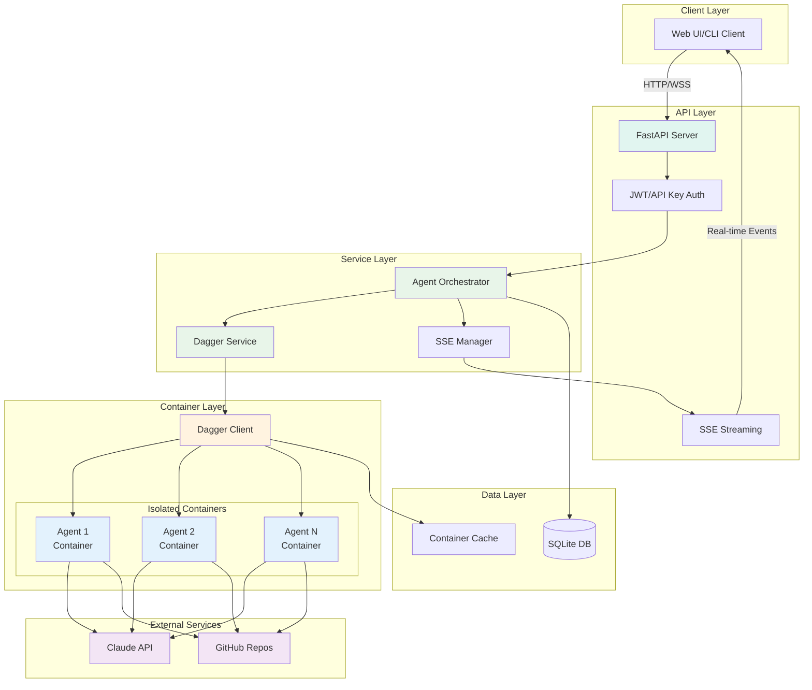
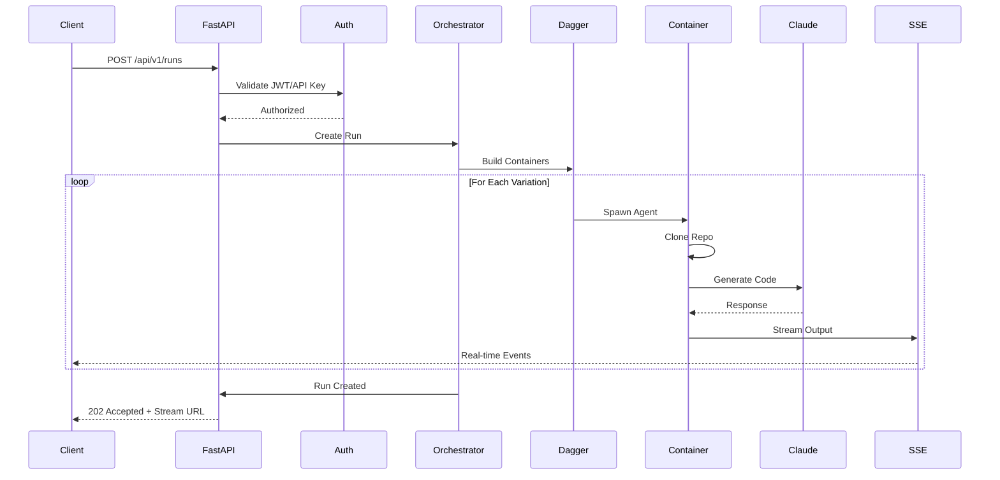

# AIdeator

A Dagger-powered LLM orchestration platform that runs multiple AI agents in isolated containers, streaming their thought processes in real-time.

## Features

- **Container Isolation**: Each agent runs in its own Dagger container
- **Real-time Streaming**: Server-Sent Events (SSE) for live agent output
- **Parallel Execution**: Run N variations of agents concurrently
- **GitHub Integration**: Clone and analyze any public repository
- **OpenAPI Documentation**: Auto-generated API docs with Swagger UI
- **Async Architecture**: Built on FastAPI with SQLModel and async patterns

## Prerequisites

- Python 3.11+
- Docker (for Dagger)
- [uv](https://github.com/astral-sh/uv) package manager
- [Dagger CLI](https://docs.dagger.io/install) v0.18.12+

## Quick Start

### 1. Clone and Setup

```bash
git clone https://github.com/yourusername/aideator.git
cd aideator

# Install dependencies with uv
uv pip install -e .

# Copy environment variables
cp .env.example .env

# Edit .env and add your ANTHROPIC_API_KEY
# Set DEBUG=true for development
```

### 2. Run Locally

```bash
# Start the FastAPI server with hot reload
uv run uvicorn app.main:app --reload

# Server runs at http://localhost:8000
# API docs at http://localhost:8000/docs
```

### 3. Test the Agent Functions

```bash
# List available Dagger functions
dagger functions

# Test a single agent directly
dagger call run-agent \
  --repo-url "https://github.com/octocat/Hello-World" \
  --prompt "Analyze this repository" \
  --anthropic-api-key env:ANTHROPIC_API_KEY

# Run development server in container (optional)
dagger call dev --source=. up --ports 8001:8000

# Run tests
dagger call test --source=.

# Run linting
dagger call lint --source=.
```

## Project Structure

```
aideator/
├── app/                           # FastAPI application (runs on host)
│   ├── api/                      # API endpoints
│   ├── core/                     # Core configuration and database
│   ├── models/                   # SQLModel database models
│   ├── schemas/                  # Pydantic validation schemas
│   ├── services/                 # Business logic and services
│   │   ├── agent_orchestrator_v2.py  # Agent orchestration
│   │   ├── dagger_module_service.py  # Dagger CLI wrapper
│   │   └── sse_manager.py           # SSE streaming
│   └── main.py                   # Application entry point
├── src/                          # Main Dagger module
│   └── main.py                   # Dagger functions (dev, test, lint, run-agent)
├── dagger_module/                # Agent-specific Dagger assets
│   └── src/aideator/
│       ├── main.py              # Agent orchestration functions
│       └── agent.py             # AI agent script
├── tests/                        # Test suite
├── pyproject.toml               # Project dependencies and config
└── dagger.json                  # Dagger module configuration
```

## Development

### API Endpoints

Key endpoints available at http://localhost:8000/docs (or http://localhost:8001/docs when using Dagger):

- `POST /api/v1/runs` - Create a new agent run
- `GET /api/v1/runs` - List all runs
- `GET /api/v1/runs/{run_id}/stream` - Stream run output via SSE
- `GET /api/v1/health` - Health check endpoint
- `POST /api/v1/auth/register` - Register new user
- `POST /api/v1/auth/login` - Login and get JWT token

### Running Tests

```bash
# Run all tests
uv run pytest

# Run with coverage
uv run pytest --cov=app --cov-report=html

# Run specific test file
uv run pytest tests/test_api.py -v
```

### Code Quality

```bash
# Format code
uv run ruff format .

# Lint code
uv run ruff check .

# Type checking
uv run mypy app/

# Security scanning
uv run bandit -r app/
uv run semgrep --config=auto app/
```

### Database

The application uses SQLite with SQLModel (async via aiosqlite). Database is created automatically on startup.

```bash
# Database location
./aideator.db

# To reset the database, simply delete the file
rm aideator.db
```

### Environment Variables

Key configuration in `.env`:

```bash
# Enable debug mode and API docs
DEBUG=true

# API configuration
ANTHROPIC_API_KEY=sk-ant-api03-...
SECRET_KEY=your-secret-key-here

# Dagger settings
AGENT_CONTAINER_IMAGE=python:3.11-slim
MAX_VARIATIONS=5
AGENT_TIMEOUT=300

# Database
DATABASE_URL=sqlite+aiosqlite:///./aideator.db
```

## Architecture

### Overview

AIdeator uses a refactored architecture that cleanly separates the FastAPI server (running on the host) from the Dagger-based agent orchestration (running in containers). This provides better separation of concerns and allows the web server to run independently of Dagger availability.

### Key Components

1. **FastAPI Server (Host)**
   - Runs directly on the host machine with `uvicorn`
   - No Dagger connection required at startup
   - Handles HTTP requests, database operations, and SSE streaming
   - Communicates with Dagger module via CLI when needed

2. **Dagger Module (Containers)**
   - All agent orchestration happens via the `aideator` Dagger module
   - Provides functions for running single or parallel agents
   - Handles container creation, dependency installation, and execution
   - Agent script located at `dagger_module/src/aideator/agent.py`

3. **Service Layer**
   - `DaggerModuleService` uses subprocess to call Dagger CLI commands
   - `AgentOrchestratorV2` manages parallel agent execution
   - Streams output from Dagger module back to SSE clients
   - Falls back gracefully if Dagger is not available

### Architecture Flow

```
User Request → FastAPI Server (Host)
                    ↓
            AgentOrchestratorV2
                    ↓
            DaggerModuleService
                    ↓
            Dagger CLI (subprocess)
                    ↓
            Dagger Module Functions
                    ↓
            Agent Containers (N variations)
```

### System Architecture



### Request Flow



### Core Components

1. **FastAPI Application**: Async web framework with automatic OpenAPI generation
2. **Dagger Service**: Container orchestration for isolated agent execution
3. **Agent Orchestrator**: Manages parallel agent execution and result aggregation
4. **SSE Streaming**: Real-time output streaming using Server-Sent Events
5. **SQLModel**: Async ORM for database operations

### Security

- JWT-based authentication
- API key authentication via `X-API-Key` header
- Rate limiting middleware
- Input validation with Pydantic
- SQL injection protection via SQLModel

### Monitoring

- Structured logging with `structlog`
- Prometheus metrics at `/api/v1/metrics`
- Request ID tracking for debugging
- Performance timing on all requests

## Contributing

1. Fork the repository
2. Create a feature branch (`git checkout -b feature/amazing-feature`)
3. Commit your changes (`git commit -m 'Add amazing feature'`)
4. Push to the branch (`git push origin feature/amazing-feature`)
5. Open a Pull Request

### Development Guidelines

- Write tests for new features
- Maintain type hints throughout
- Follow existing code patterns
- Update API documentation
- Run the full test suite before submitting

## Manual Testing Guide

### Step 1: Verify Server Health

```bash
# Check that server is running independently
curl http://localhost:8000/health

# Expected response:
{
  "status": "healthy",
  "version": "1.0.0",
  "dagger_module": "aideator"
}
```

### Step 2: Create an Agent Run

```bash
# Create a run with 2 agent variations
curl -X POST http://localhost:8000/api/v1/runs \
  -H "Content-Type: application/json" \
  -d '{
    "github_url": "https://github.com/octocat/Hello-World",
    "prompt": "Analyze this repository and suggest improvements",
    "variations": 2,
    "agent_config": {
      "model": "claude-3-opus-20240229",
      "temperature": 0.7,
      "max_tokens": 1000
    }
  }'

# Response includes:
{
  "run_id": "run_abc123...",
  "stream_url": "/api/v1/runs/run_abc123.../stream",
  "status": "accepted",
  "estimated_duration_seconds": 80
}
```

### Step 3: Stream Real-time Output

```bash
# Stream agent outputs using the stream_url from above
curl -N http://localhost:8000/api/v1/runs/run_abc123.../stream

# You'll see Server-Sent Events:
event: agent_output
data: {"type": "agent_output", "variation_id": 0, "content": "[Agent 0] Starting analysis..."}

event: agent_output
data: {"type": "agent_output", "variation_id": 1, "content": "[Agent 1] Starting analysis..."}

event: run_complete
data: {"type": "run_complete", "status": "completed"}
```

### Step 4: Check Results

```bash
# List all runs
curl http://localhost:8000/api/v1/runs | jq

# Get specific run details
curl http://localhost:8000/api/v1/runs/run_abc123 | jq

# Get run outputs
curl http://localhost:8000/api/v1/runs/run_abc123/outputs | jq
```

### Testing Parallel Execution

```bash
# Create multiple runs simultaneously
# Terminal 1:
curl -X POST http://localhost:8000/api/v1/runs \
  -H "Content-Type: application/json" \
  -d '{"github_url": "https://github.com/fastapi/fastapi", "prompt": "Analyze routing", "variations": 2}'

# Terminal 2 (at the same time):
curl -X POST http://localhost:8000/api/v1/runs \
  -H "Content-Type: application/json" \
  -d '{"github_url": "https://github.com/tiangolo/sqlmodel", "prompt": "Analyze ORM", "variations": 2}'
```

### Architecture Verification

Test that the server runs independently of Dagger:

```bash
# 1. Stop Dagger engine
docker stop dagger-engine-v0.18.12

# 2. Server health should still work
curl http://localhost:8000/health

# 3. Creating runs will fail gracefully
# 4. Restart Dagger
docker start dagger-engine-v0.18.12
```

## Troubleshooting

### Common Issues

1. **Dagger SSH Socket Error**: Unset SSH_AUTH_SOCK before running Dagger commands
   ```bash
   export SSH_AUTH_SOCK=""
   ```

2. **Module Import Errors**: Ensure you're using `uv` to manage dependencies
   ```bash
   uv pip install -e .
   ```

3. **Database Locked**: Stop all running instances before starting a new one

4. **Port Already in Use**: Kill the process using port 8000
   ```bash
   lsof -ti:8000 | xargs kill -9
   ```

## License

MIT License - see LICENSE file for details