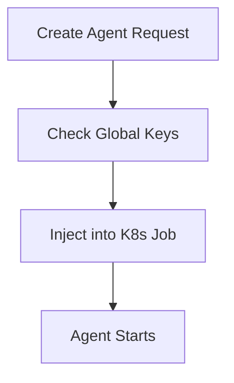
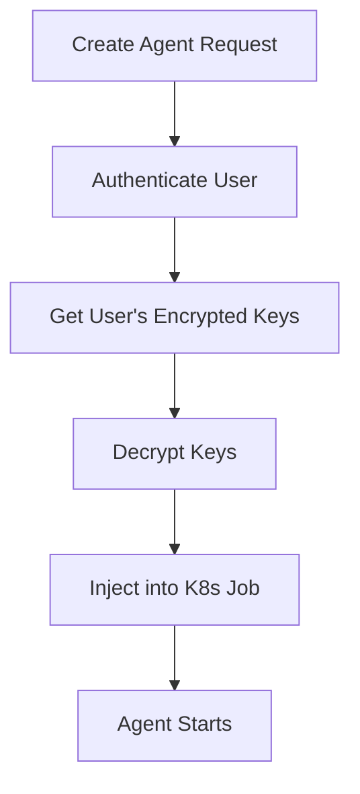
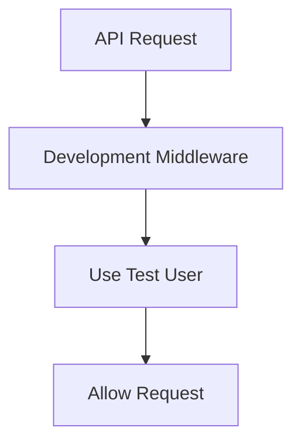
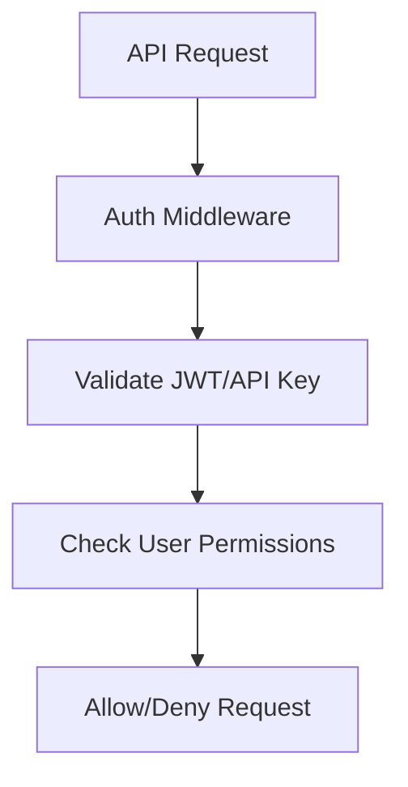

# AIdeator Feature Flags Documentation

This document explains the feature flag system that allows AIdeator to operate in both simplified development mode and full production mode.

## 🎯 Overview

AIdeator uses environment-based feature flags to control which security and complexity features are enabled. This allows:

- **Student/Development Mode**: Simplified setup with global API keys and bypassed authentication
- **Production Mode**: Full security with per-user encrypted keys and complete authentication

## 🚩 Feature Flag Categories

### 1. Authentication Features

#### `REQUIRE_USER_REGISTRATION` (default: `true`)
- **Purpose**: Controls whether the user registration/login system is enabled
- **Development**: `true` (keep user system for future features)
- **Production**: `true`
- **Impact**: When `false`, completely disables user accounts

#### `REQUIRE_API_KEYS_FOR_AGENTS` (default: `true`)
- **Purpose**: Controls whether agents require API keys to run
- **Development**: `false` (allows agents to run without key setup)
- **Production**: `true`
- **Impact**: When `false`, agents can run even if no API keys are configured

#### `REQUIRE_PER_USER_KEYS` (default: `true`)
- **Purpose**: Controls whether API keys are stored per-user or globally
- **Development**: `false` (use global environment variables)
- **Production**: `true` (encrypted per-user storage)
- **Impact**: When `false`, uses global `OPENAI_API_KEY`, `ANTHROPIC_API_KEY`, etc.

#### `ENABLE_KUBERNETES_SECRETS` (default: `true`)
- **Purpose**: Controls whether to use Kubernetes secret injection
- **Development**: `false` (use environment variables)
- **Production**: `true` (use K8s secrets)
- **Impact**: When `false`, skips complex Kubernetes secret management

### 2. Security Features

#### `ENABLE_RATE_LIMITING` (default: `true`)
- **Purpose**: Controls API rate limiting
- **Development**: `false` (unlimited requests)
- **Production**: `true`
- **Impact**: When `false`, disables all rate limiting middleware

#### `ENABLE_CORS_STRICT` (default: `true`)
- **Purpose**: Controls CORS policy strictness
- **Development**: `false` (allow all origins)
- **Production**: `true` (strict origin checking)
- **Impact**: When `false`, sets `allowed_origins: ["*"]`

#### `ENABLE_JWT_EXPIRATION` (default: `true`)
- **Purpose**: Controls JWT token expiration
- **Development**: `false` (long-lived tokens)
- **Production**: `true` (short-lived tokens)
- **Impact**: When `false`, extends `access_token_expire_minutes` to 2880 (48 hours)

### 3. Development Shortcuts

#### `SIMPLE_DEV_MODE` (default: `false`)
- **Purpose**: Master switch for development simplification
- **Development**: `true`
- **Production**: `false`
- **Impact**: When `true`, automatically sets multiple other flags for development

#### `AUTO_CREATE_TEST_USER` (default: `false`)
- **Purpose**: Auto-creates test user on application startup
- **Development**: `true`
- **Production**: `false`
- **Impact**: Creates `test@aideator.local` / `testpass123` user with admin privileges

## 📋 Flag Combinations

### Development Configuration
```bash
# In .env.local
SIMPLE_DEV_MODE=true
REQUIRE_USER_REGISTRATION=true
REQUIRE_API_KEYS_FOR_AGENTS=false
REQUIRE_PER_USER_KEYS=false
ENABLE_KUBERNETES_SECRETS=false
ENABLE_RATE_LIMITING=false
ENABLE_CORS_STRICT=false
ENABLE_JWT_EXPIRATION=false
AUTO_CREATE_TEST_USER=true
```

### Production Configuration
```bash
# In .env (production)
SIMPLE_DEV_MODE=false
REQUIRE_USER_REGISTRATION=true
REQUIRE_API_KEYS_FOR_AGENTS=true
REQUIRE_PER_USER_KEYS=true
ENABLE_KUBERNETES_SECRETS=true
ENABLE_RATE_LIMITING=true
ENABLE_CORS_STRICT=true
ENABLE_JWT_EXPIRATION=true
AUTO_CREATE_TEST_USER=false
```

### Testing Configuration (Hybrid)
```bash
# For integration testing
SIMPLE_DEV_MODE=false
REQUIRE_USER_REGISTRATION=true
REQUIRE_API_KEYS_FOR_AGENTS=true
REQUIRE_PER_USER_KEYS=false  # Use global keys for testing
ENABLE_KUBERNETES_SECRETS=false
ENABLE_RATE_LIMITING=false
ENABLE_CORS_STRICT=false
ENABLE_JWT_EXPIRATION=true
AUTO_CREATE_TEST_USER=true
```

## 🔧 Implementation Details

### Configuration Loading
The flags are loaded in `app/core/config.py`:

```python
class Settings(BaseSettings):
    # Feature flags with defaults
    require_user_registration: bool = True
    require_api_keys_for_agents: bool = True
    require_per_user_keys: bool = True
    enable_kubernetes_secrets: bool = True
    enable_rate_limiting: bool = True
    enable_cors_strict: bool = True
    enable_jwt_expiration: bool = True
    simple_dev_mode: bool = False
    auto_create_test_user: bool = False
    
    @model_validator(mode="after")
    def validate_settings(self) -> "Settings":
        """Apply development shortcuts when enabled."""
        if self.simple_dev_mode or self.environment == "development":
            # Auto-configure for development
            self.require_api_keys_for_agents = False
            self.require_per_user_keys = False
            self.enable_kubernetes_secrets = False
            self.enable_rate_limiting = False
            self.enable_cors_strict = False
            self.enable_jwt_expiration = False
            self.access_token_expire_minutes = 2880
        return self
```

### Authentication Bypass
In `app/core/dependencies.py`:

```python
async def get_current_user(request: Request, ...) -> User:
    settings = get_settings()
    
    # Check for development user bypass
    if settings.simple_dev_mode:
        dev_user = await get_dev_user_from_request(request)
        if dev_user:
            return dev_user
    
    # Normal authentication flow
    return await authenticate_user(credentials, db)
```

### Global Key Service
In `app/services/global_key_service.py`:

```python
def get_provider_key(self, provider: str, user_id: Optional[str] = None) -> Optional[str]:
    # Check flag to determine key source
    if self.settings.require_per_user_keys and user_id:
        # Use user-specific encrypted keys
        return get_user_encrypted_key(user_id, provider)
    
    # Use global environment variables
    return os.getenv(f"{provider.upper()}_API_KEY")
```

## 🎛️ Runtime Behavior

### Agent Creation Flow

**Development Mode (`REQUIRE_API_KEYS_FOR_AGENTS=false`)**:


**Production Mode (`REQUIRE_API_KEYS_FOR_AGENTS=true`)**:


### API Access Control

**Development Mode (`SIMPLE_DEV_MODE=true`)**:


**Production Mode (`SIMPLE_DEV_MODE=false`)**:


## 🚀 Deployment Considerations

### Environment-Specific Settings

**Local Development**:
- Use `.env.local` with development flags
- Auto-generate security keys
- Use test database

**Staging**:
- Use production-like flags but with test data
- Use staging database
- May use global keys for testing

**Production**:
- All security flags enabled
- Strong manually-set keys
- Per-user encrypted API keys
- Kubernetes secrets enabled

### Migration Path

**From Development to Production**:
1. Set `SIMPLE_DEV_MODE=false`
2. Set `REQUIRE_PER_USER_KEYS=true`
3. Configure strong `SECRET_KEY` and `ENCRYPTION_KEY`
4. Set up Kubernetes secrets
5. Enable rate limiting and strict CORS
6. Test user registration and key management flows

## 📊 Flag Impact Matrix

| Flag | Authentication | API Keys | Security | Performance | Complexity |
|------|---------------|----------|----------|-------------|------------|
| `SIMPLE_DEV_MODE=true` | Bypassed | Global | Minimal | Fast | Low |
| `REQUIRE_PER_USER_KEYS=false` | Normal | Global | Medium | Fast | Medium |
| `ENABLE_KUBERNETES_SECRETS=false` | Normal | Per-User | High | Medium | Medium |
| All Production Flags | Full | Encrypted | Maximum | Slower | High |

## 🐛 Debugging Flags

### Common Issues

**"API key required" errors in development**:
- Check `REQUIRE_API_KEYS_FOR_AGENTS=false`
- Check `SIMPLE_DEV_MODE=true`

**"Invalid API key" errors**:
- Check `REQUIRE_PER_USER_KEYS=false` for global keys
- Verify keys in `.env.local`

**Authentication loops**:
- Check `AUTO_CREATE_TEST_USER=true`
- Verify development middleware is loaded

### Debug Commands

```bash
# Check current flag values
curl http://localhost:8000/api/v1/debug/settings

# Verify development user exists
curl http://localhost:8000/api/v1/auth/dev/test-login

# Check global keys availability
curl http://localhost:8000/api/v1/debug/keys
```

## 🔮 Future Considerations

### Planned Features
- Role-based flag inheritance
- Dynamic flag updates via admin interface
- Flag audit logging
- A/B testing support

### Extension Points
- Custom flag validators
- Flag-dependent middleware loading
- Feature-specific database migrations
- Flag-aware frontend components

---

**💡 Pro Tip**: Use `SIMPLE_DEV_MODE=true` as the master switch for development. It automatically configures most other flags appropriately.